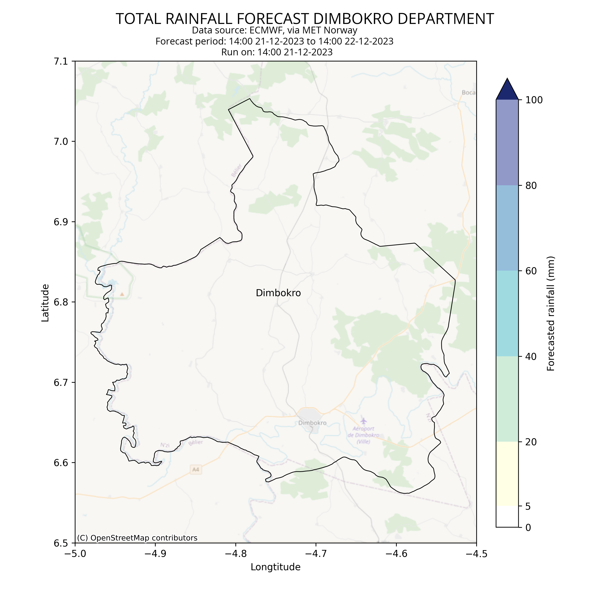

# rainfall-monitor-metnoAPI

A code to visualise rainfall forecast as maps 3 days lead time (72 hours ahead). It gets free weather data service provided by the [Norwegian Meteorological Institute](https://www.met.no/en).

Built upon [metno-locationforecast](https://github.com/Rory-Sullivan/metno-locationforecast) Python package.

This is developed for Malawi Red Cross Society and Danish Red Cross focused on Southern Region, Malawi.

## What does the code do?
The code comprise of 5 main tasks:
1. Get weather forecast gridded data and extract rainfall forecast for a selected area.
2. Aggregate gridded data per area per 24-hour step (1-day cumulative).
3. Check per area if 1-day cumulative rain exceeds a given threshold.
4. Visualise forecast rainfall over area per each 24-hour step.
5. (for Malawi) This code was dockerised and deployed using Azure Logic App. With the Logic app, warning is automatically sent to selected recipients when the given threshold is exceeded (in step 3) in order to inform early a heavy rain forecasted.

## Examples of the forecast map

Above is an example of a forecast for Dimboko Department, Ivory Coast. It includes a title section, and map content section.
- Title: general information can be found on top of each map such as title, the 24-hour range of the forecast (for example: 06:00 30-11-2022 to 06:00 30-11-2022) and the time when the forecast is issued (for example: 06:00 30-11-2022).
- Map content: 3 layers.
    + Basemap layer: a basemap from [OpenStreetMap](https://www.openstreetmap.org/) over the area of interest.
    + Department layer: boundaries of Dimbokro department are shown with black color.
    + Rainfall layer: overlaid on top of those layers is cumulative forecast rainfall of a certain 24-hour range indicated in the title of the map.

How to interpret the maps:
- Look at the rainfall layer, you can find out how heavy the rain is forecasted based on the color. It is depicted in a range of 7 discreted colors from white, light yellow to blue and very dark blue. The color bar on the right hand side of the map helps you to translate the color of rainfall layer to forecasted amount of rainfall. For instance white color indicates no or up to 5 mm rainfall, light yellow indicates rainfall of 5 mm to 20 mm (light rain), dark blue is for the rainfall beyond 100 mm (heavy rain), etc.
- Then look at the layers below it to find out which areas are exposed to the heavy rainfall.

## Set-up guidance

- [Customisation](docs/customisation.md) for an area of interest
- [Deployment](docs/deployment.md)

